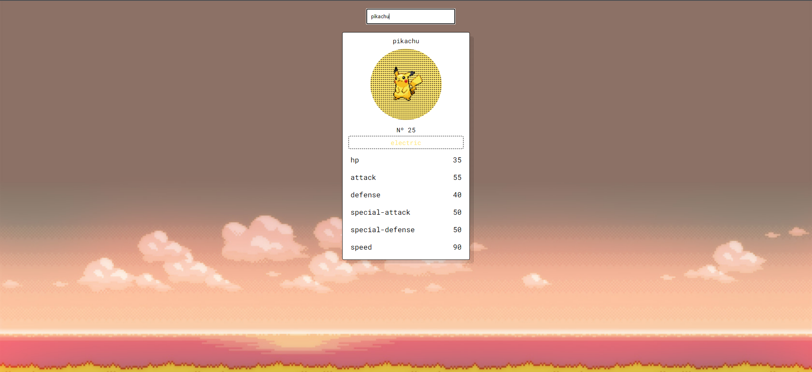

# Pokedex

Consumimos la siguiente API [PokeAPI](https://pokeapi.co) para mostrar los datos de los diferentes pokemon.
Aquí tienes la página web para interactuar con ella => **[Pokedex](https://diegocorchuelo.github.io/Pokedex/)**

## Mirá un poco de la página:

Puedes buscar la información de los pokemon usando su nombre o ID.

